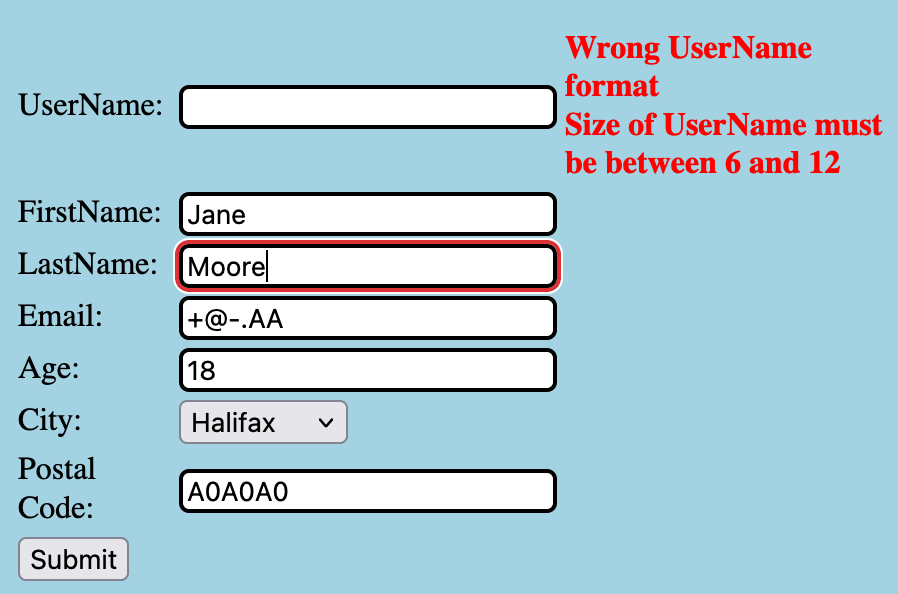

**Exercise 1**
The following are my test case Values 

|     | Test Case                         | Expected Result               | Actual Result                  | Verdict |
| --- | --------------------------------- | ----------------------------- | ------------------------------ | ------- |
| T1  | | accepted                      |  |fail|
| T2  |       | accepted registration request | ![[Lab2EX1T2_2.png]]           | Pass    |
| T3  |  | accepted registration request |  | Pass    |

**Exercise 2**
These are the Junit Test Results.

Tutorial 2

EC-1 Valid inputs
month <=12 month > 0 
day <=31, day > 0
year >= 0
EC-2 Invalid inputs
year < 0
day > 31 
month > 12
EC-2.1 day, month <= 0
EC-2.2; Invalid values Leap year
EC-2.3; Invalid Values 31st on 30day month

TC-1: 31/12/0000
TC-2: 32/13/-1
TC-2.1: 0/0/2021
TC-2.2: 29/2/1001
TC-2.3: 31/6/2002
