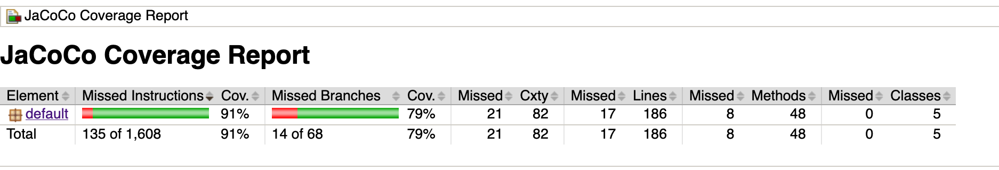
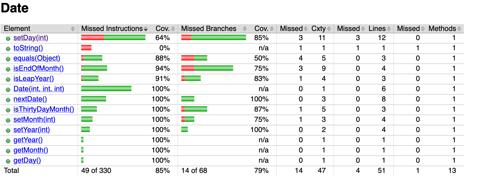
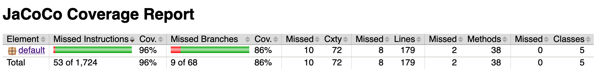
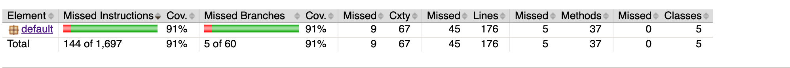
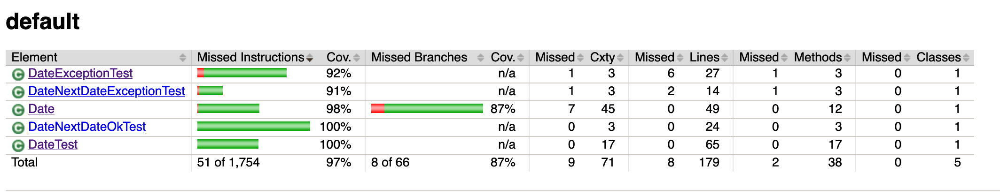
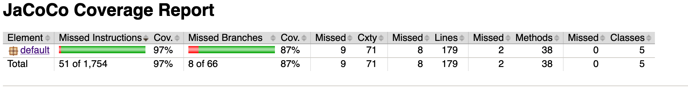

<h1>Lab 03</h1>

Author Ahmed Babar SID (300454451)
The above image is Jacoco Running without any refactoring, in order words the default report.

As indicated in the screenshot below, 85% branch coverage, 64% instruction coverage.

I fixed setDay according to Jacoco suggestions. I removed 4 testcases from DateTest that should belong in NextDateExceptions

I comment out Date class method equals() , there is an improvement with overall 91%. but 2 Testcases had failed

I commented out 1 line from equals()

I added one more test case

In the end I got to 97% instruction coverage + 87% branch coverage. It is difficult to achieve 100% coverage since there are many small details i dont know how to fix. For example it says DateException misses 1 method.

All Testcases passed.

