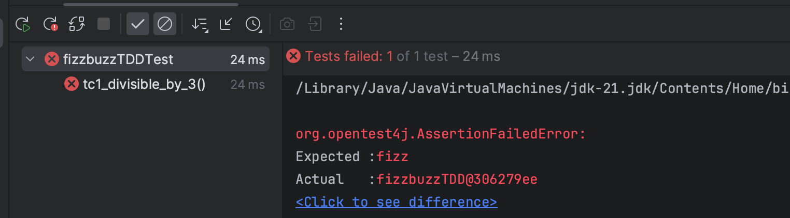
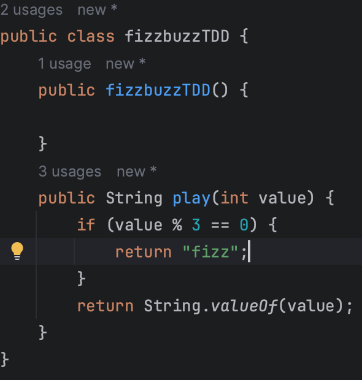
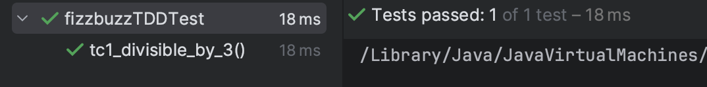
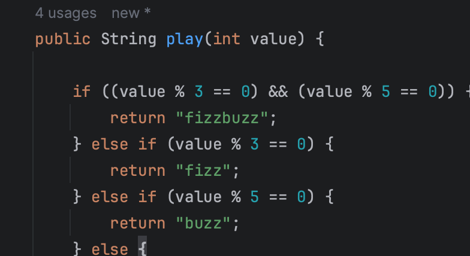
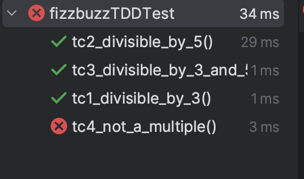
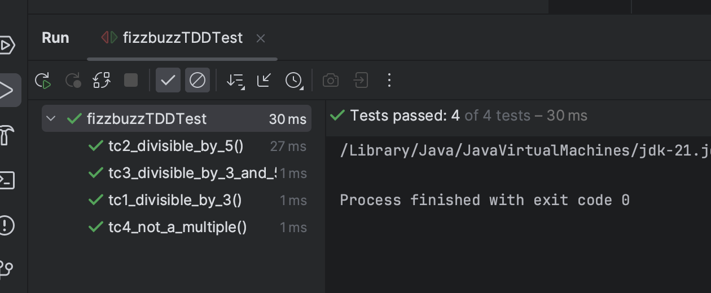

First Commit.

This test does not pass 
Second Commit 

Third Commit
I have added 2 more test
![[img/commit3.png]]
The first test cause passes but it should also fail since it does not return full fizzbuzz
![[img/commit3-1.png]]
4th Commit

I updated the implementation now the test should pass. I have also added one more test.

5th commit

