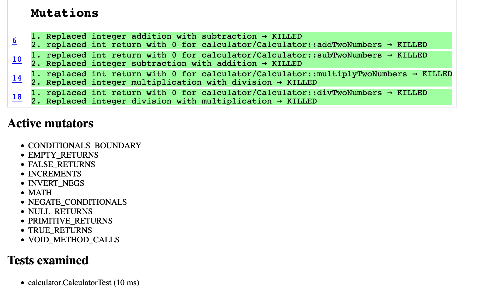

By Ahmed Babar 300454451 
<h1>Lab 08</h1>

<h2>Deliverables</h2>
After properly configuring the program, executing the code produced the following output

Screenshots of PIT Plugin

2.1 Screenshots of Report

<h3>2.2 What are the mutations doing? What is the report telling you?</h3>
The mutations are making small changes to the code, like switching addition with subtraction, to see if the tests implement can catch these mistakes. The report shows which changes were made and whether your tests found the errors.

<h3>2.3 What does it mean for a mutant to be killed?</h3>
When a mutant is "killed," it means your tests found and flagged the mistake. This is what you would want since it shows your tests are working well. The more mutants your tests catch, the better your tests are. If a mutant isn't caught, it means your tests are missing something.
